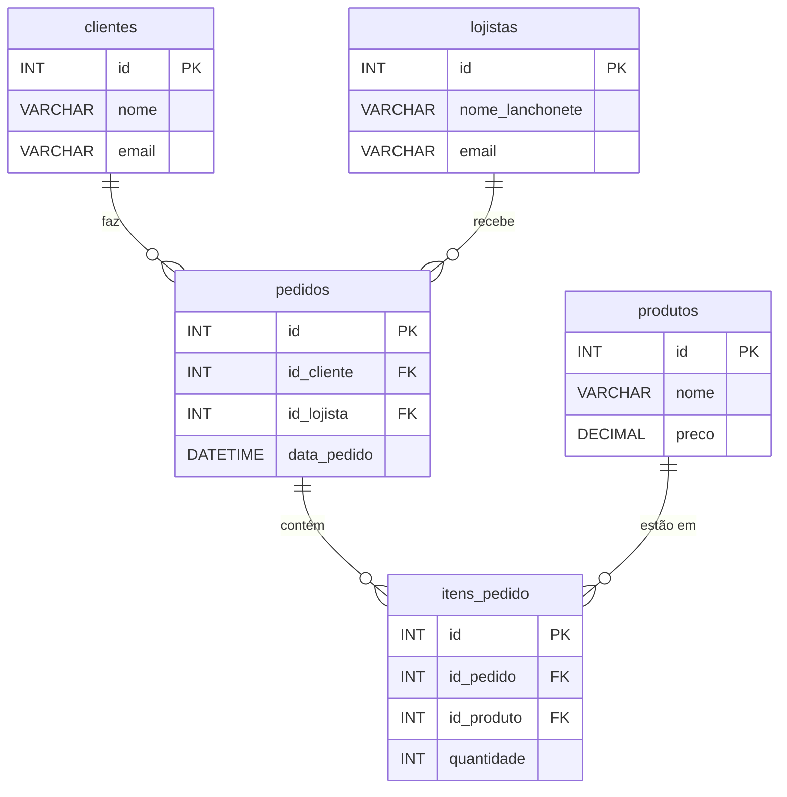

# 🍔 CodexLanche-SQL


Sistema de gerenciamento de pedidos para uma lanchonete fictícia, desenvolvido com foco em **modelagem** e **manipulação** de banco de dados SQL.

---

## 📦 Estrutura do Projeto

Este repositório contém os scripts SQL para criação e manipulação das seguintes tabelas e funcionalidades:

- **`clientes`**: Armazena informações dos clientes.  
- **`produtos`**: Armazena informações sobre os produtos disponíveis no cardápio.  
- **`pedidos`**: Registra os pedidos feitos pelos clientes.  
- **`itens_pedido`**: Relaciona os produtos aos pedidos.  

Além disso, também inclui exemplos de consultas SQL para interação com as tabelas criadas.

---

## 🛠️ Tecnologias Utilizadas

- **SQL** (MySQL ou PostgreSQL)  
- **Git & GitHub** para versionamento  
- **Cmder / Terminal** para execução dos scripts  
- **MySQL Workbench** ou **pgAdmin** para gerenciamento de banco de dados (opcional)  

---

## 🚀 Como Usar

1. **Clone o repositório:**
   ```bash
   git clone https://github.com/okingsaam/CodexLanche-SQL.git


Importe os arquivos `.sql` no seu gerenciador de banco de dados.  
Você pode fazer isso pelo **MySQL Workbench**, **pgAdmin**, ou diretamente pelo **terminal**, dependendo do seu SGBD preferido.

### ▶️ Ordem de execução
Para garantir que as dependências entre as tabelas sejam criadas corretamente, execute os scripts na ordem abaixo:

1. `db_codexlanche_clientes.sql`  
2. `db_codexlanche_produtos.sql`  
3. `db_codexlanche_pedidos.sql`  
4. `db_codexlanche_itens_pedido.sql`  

Esses scripts irão criar as tabelas no banco de dados e configurar todos os **relacionamentos** corretamente.

📊 Exemplo de Consulta

Após a execução dos scripts, você pode utilizar a seguinte consulta SQL para obter detalhes de um pedido, incluindo informações sobre o cliente e os produtos pedidos:

## 📊 Exemplo de consulta

A query abaixo retorna os pedidos com o nome do cliente, produto e a quantidade:

```sql
SELECT 
    p.id          AS id_pedido, 
    c.nome        AS nome_cliente, 
    pr.nome       AS nome_produto, 
    ip.quantidade AS quantidade
FROM pedidos p
JOIN clientes c 
    ON p.id_cliente = c.id
JOIN itens_pedido ip 
    ON p.id = ip.id_pedido
JOIN produtos pr 
    ON ip.id_produto = pr.id;
```
## 🔎 Explicação do resultado

- **id_pedido**: Identificação única do pedido.  
- **nome_cliente**: Nome do cliente que realizou o pedido.  
- **nome_produto**: Nome do produto incluído no pedido.  
- **quantidade**: Quantidade de cada produto no pedido.  

Esse `SELECT` é útil para verificar todos os produtos de um pedido específico, juntamente com o cliente que fez a compra.  

---

## 🧩 Relacionamento entre as Tabelas

### **clientes**
- Contém informações sobre os clientes da lanchonete.  
- **Chave primária**: `id`

### **produtos**
- Contém informações sobre os produtos disponíveis no cardápio.  
- **Chave primária**: `id`

### **pedidos**
- Armazena os pedidos feitos pelos clientes.  
- **Chave primária**: `id`  
- **Chaves estrangeiras**:  
  - `id_cliente` → relaciona-se com a tabela **clientes**  
  - `id_lojista` → relaciona-se com a tabela **lojistas**

### **itens_pedido**
- Relaciona os produtos aos pedidos.  
- **Chave primária**: `id`  
- **Chaves estrangeiras**:  
  - `id_pedido` → relaciona-se com a tabela **pedidos**  
  - `id_produto` → relaciona-se com a tabela **produtos**

Essas tabelas são projetadas para manter o banco de dados normalizado e evitar duplicação de dados.  

---

## 📐 Diagrama ER (Entidade-Relacionamento)


### Versão em Mermaid

---

💡 Contribuindo

Sinta-se à vontade para contribuir com melhorias, sugestões ou correções. Para isso, basta seguir os seguintes passos:

Fork este repositório

Crie uma branch para sua nova feature (git checkout -b feature/nova-feature)

Commit suas alterações (git commit -m 'Adiciona nova feature')

Push para a branch (git push origin feature/nova-feature)

Abra um Pull Request

---

⚠️ Licença

Este projeto está licenciado sob a Licença MIT - consulte o arquivo LICENSE para mais detalhes.

---

📝 Notas Finais

Este projeto é um projeto de estudo, no qual estou apenas testando meus conhecimentos e buscando melhorar.
O foco é entender e aplicar boas práticas de modelagem e manipulação de banco de dados.
Não é um projeto em produção, e ainda está em fase de aprendizado e testes.

---

---

## 👨‍💻 Autor

**Sam Douglas**  
📧 samdouglask88@gmail.com  
🐙 [github.com/okingsaam](https://github.com/okingsaam)  
🔗 [linkedin.com/in/sam-douglas-6076b91b8](https://linkedin.com/in/sam-douglas-6076b91b8)  

